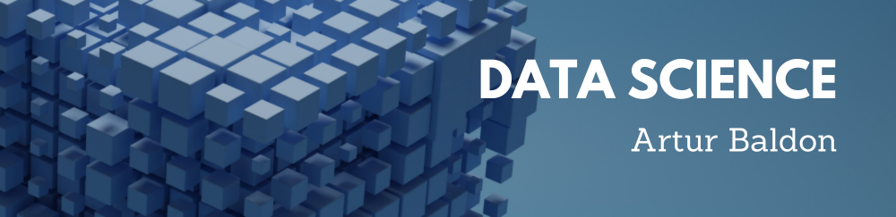

# Artur de Camargo Baldon
*Graduando em Tecnologia em Ciência de Dados* pela Cruzeiro do Sul

Meu portfólio de Data Science: uma coleção de projetos demonstrando minhas habilidades em análise de dados, **machine learning** e visualização de dados. Explore os projetos e entre em contato para saber mais!

## Projetos:

* **Como usar o Histograma para Data Science:** https://bit.ly/2L2cMwy
* **Como Implementar Regressão Linear com Python:** https://bit.ly/2Li5pzY
* **Data Science: Investigando o naufrágio do Titanic:** https://bit.ly/2Ubr5SH
* **Como Tratar Dados Ausentes com Pandas:** https://bit.ly/31KWSMN
* **XGBoost: aprenda este algoritmo de Machine Learning em Python:** https://bit.ly/2UbRhws
* **Como criar uma Wordcloud em Python:** https://bit.ly/2OxsphM
* **Como lidar com dados desbalanceados:** https://bit.ly/2ZlaNsV
---
